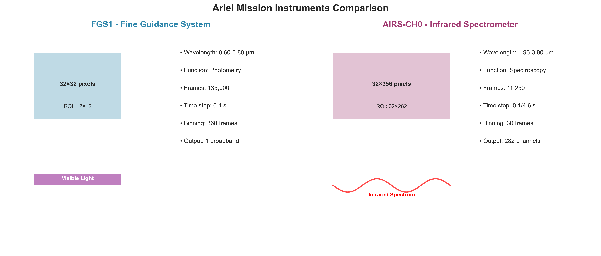
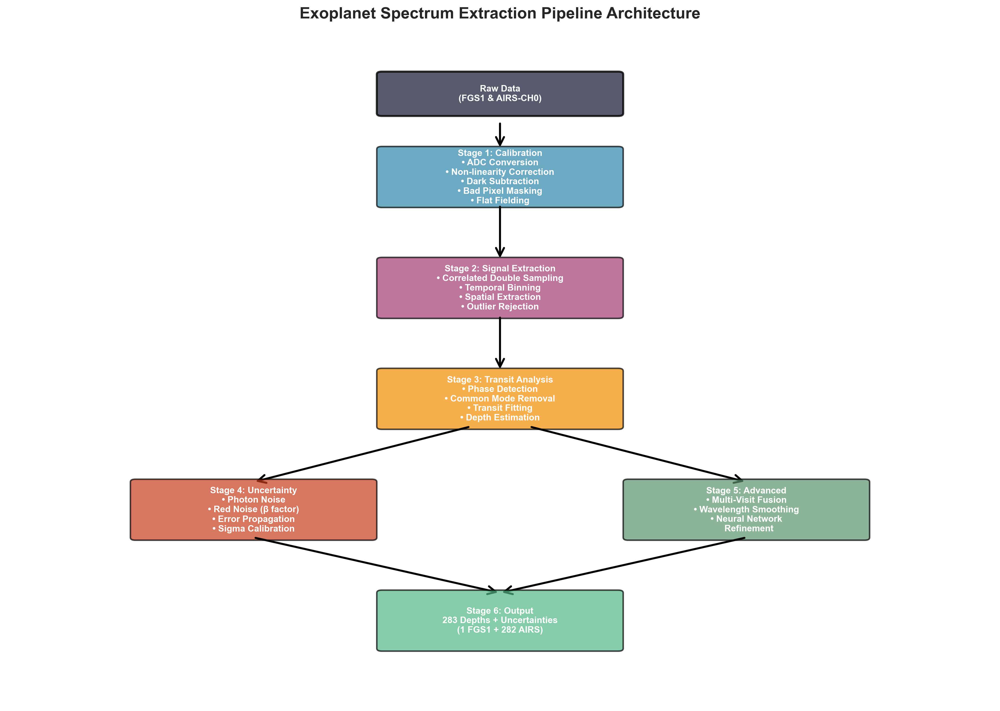
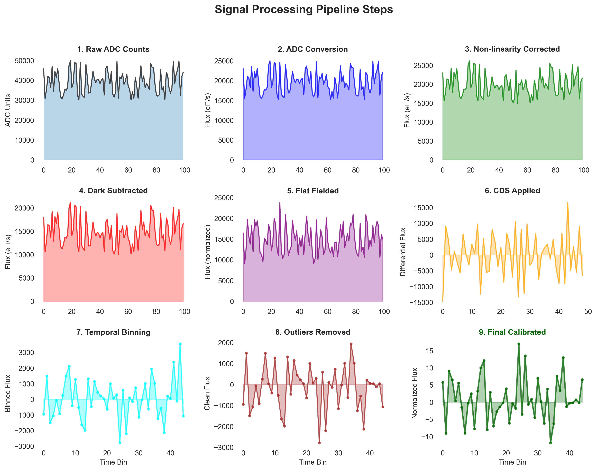
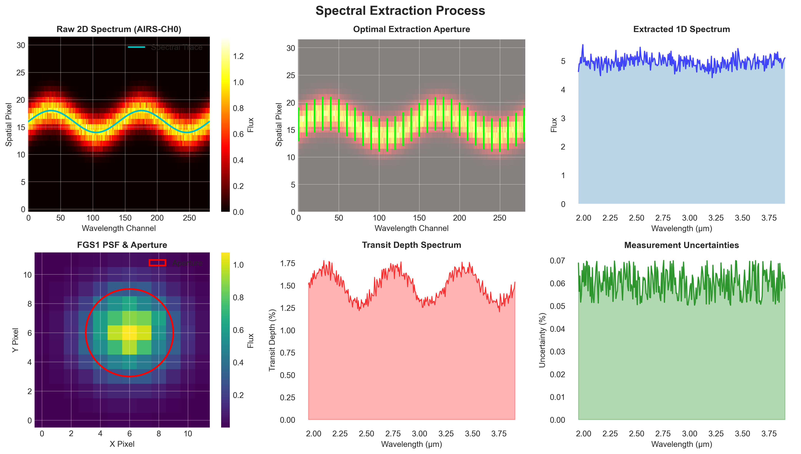
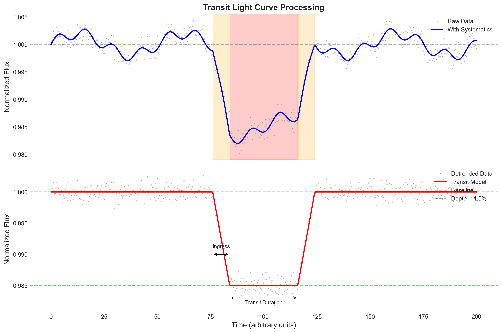

# NeurIPS Ariel Data Challenge 2025: Extracting Exoplanet Atmospheres

## Project Overview

This repository contains a comprehensive solution for the NeurIPS Ariel Data Challenge 2025, which focuses on extracting the chemical composition of exoplanet atmospheres from simulated telescope observations. The challenge simulates data from the European Space Agency's Ariel mission, scheduled to launch in 2029, which will characterize approximately 1,000 exoplanets through transit spectroscopy.

When an exoplanet passes in front of its host star, a small amount of starlight filters through the planet's atmosphere. By analyzing how the atmosphere absorbs light at different wavelengths, scientists can determine its chemical composition. However, these signals are extremely faint and buried in complex, time-dependent noise from both the instruments and the stars themselves. This competition addresses the critical challenge of recovering true exoplanet spectra from these noisy observations.

### Key Objectives
- Extract accurate atmospheric spectra from noisy time-series observations
- Handle complex instrumental systematics and stellar noise
- Quantify prediction uncertainties to enable reliable scientific inference
- Support preparation for the actual Ariel mission through algorithm development

## Dataset Description

The dataset contains simulated observations from two Ariel instruments, each capturing different aspects of exoplanet transits:

### Instruments

**FGS1 (Fine Guidance System Channel 1)**
- Primary function: Stellar pointing and guidance
- Secondary function: High-precision visible-light photometry
- Wavelength range: 0.60-0.80 μm
- Data format: 135,000 frames of 32×32 pixel images per observation
- Temporal resolution: 0.1 second time steps

**AIRS-CH0 (Ariel InfraRed Spectrometer Channel 0)**
- Function: Infrared spectroscopy for atmospheric characterization
- Wavelength range: 1.95-3.90 μm
- Spectral resolution: R ≈ 100
- Data format: 11,250 frames of 32×356 pixel images per observation
- Temporal resolution: Variable (0.1s base + 4.5s for odd frames)

### Data Structure

Each planet observation includes:

**Signal Files**
- Raw detector readouts in uint16 format
- Alternating low/high flux levels from correlated double sampling
- Multiple visits available for some planets

**Calibration Files**
- Dark frames: Thermal noise and bias measurements
- Dead pixel maps: Non-responsive pixel identification
- Flat fields: Pixel sensitivity and optical system corrections
- Linearity corrections: Polynomial coefficients for detector response
- Read noise: Electronic noise characterization

**Metadata**
- Stellar parameters: radius, mass, temperature
- Planetary parameters: mass, orbital period, eccentricity, inclination
- ADC conversion parameters for dynamic range restoration
- Wavelength grids for spectral mapping

### Data Characteristics
- Training set: ~500 planets with ground truth spectra
- Test set: ~1,100 planets (hidden)
- Some planets have multiple observation visits
- Each spectrum contains 283 wavelength channels (1 FGS1 + 282 AIRS-CH0)

## Pipeline Architecture

The solution implements a sophisticated multi-stage pipeline that processes raw detector images into calibrated exoplanet spectra with uncertainty estimates.

### Stage 1: Calibration

**ADC Conversion and Dynamic Range Restoration**
The raw 16-bit integer detector readouts are converted to physical flux units using instrument-specific gain and offset parameters. This restoration is critical for preserving the full dynamic range of the observations.

**Non-linearity Correction**
Detector response becomes non-linear as pixels approach saturation. The pipeline applies polynomial corrections (degree 6) to linearize the detector response, ensuring accurate flux measurements across the full dynamic range.

**Dark Current Subtraction**
Thermal electrons accumulate in the detector even without illumination. The pipeline subtracts scaled dark frames, accounting for different integration times between even (0.1s) and odd (4.6s for AIRS) frames.

**Bad Pixel Masking**
Dead and hot pixels are identified through calibration frames and statistical analysis (5-sigma clipping). Bad pixels are masked and their values interpolated from neighboring pixels using median filtering.

**Flat Fielding**
Pixel-to-pixel sensitivity variations and optical system irregularities are corrected by dividing by normalized flat field frames, ensuring uniform response across the detector.

### Stage 2: Signal Extraction

**Correlated Double Sampling (CDS)**
The alternating high/low flux pattern from the detector readout scheme is processed through CDS, which differences consecutive frame pairs to remove common-mode noise and extract the accumulated signal.

**Temporal Binning**
To improve signal-to-noise ratio, frames are binned temporally:
- FGS1: 360 frames (36 seconds) per bin
- AIRS-CH0: 30 frames (variable time) per bin

**Spatial Extraction**

Different extraction strategies optimize signal recovery for each instrument:
- FGS1: Simple aperture photometry over a 12×12 pixel region centered on the stellar PSF
- AIRS-CH0: Spectral extraction along the dispersed spectrum, averaging over spatial pixels

**Outlier Rejection**
Statistical clipping (5th-95th percentile) removes cosmic ray hits and other transient artifacts that could contaminate the transit signal.

### Stage 3: Transit Analysis

**Phase Detection**
The pipeline automatically identifies transit ingress, mid-transit, and egress phases using gradient analysis of the smoothed light curve. This phase information is crucial for separating in-transit and out-of-transit data.

**Common Mode Removal**
Systematic effects common across wavelengths are identified from the FGS1 white-light curve and removed from the spectroscopic channels. This leverages the high-precision photometry to improve spectroscopic measurements.

**Transit Model Fitting**
A simple box-car transit model is fit to each wavelength channel independently. The fitting process includes:
- Iterative detrending using Savitzky-Golay filtering
- Robust estimation using median statistics
- Phase-constrained optimization to ensure physical transit shapes

**Depth Estimation**
Transit depths are calculated as the fractional flux decrease during transit:
- Out-of-transit baseline established from pre- and post-transit data
- In-transit level measured during the planetary crossing
- Depth computed as (1 - flux_in/flux_out) with appropriate scaling

### Stage 4: Uncertainty Quantification

**Photon Noise Estimation**
Base uncertainties are computed from Poisson statistics, considering the number of photons collected and detector read noise.

**Red Noise Characterization**
The beta factor quantifies correlated noise by comparing the reduction in scatter when binning data. This captures systematic effects not removed by calibration.

**Error Propagation**
Uncertainties are propagated through all processing steps using standard error propagation formulas, accounting for correlations where applicable.

**Sigma Calibration**
Final uncertainties are calibrated using:
- Noise floor enforcement (2×10^-4 for both instruments)
- SNR-dependent scaling
- Beta inflation for correlated noise
- Empirical calibration factors derived from out-of-transit scatter

### Stage 5: Advanced Processing

**Multi-Visit Fusion**
When multiple observations of the same planet are available, they are combined using inverse-variance weighting to improve precision.

**Wavelength Smoothing**
Gentle smoothing across adjacent wavelength channels reduces uncorrelated noise while preserving spectral features. The smoothing strength is adaptively adjusted based on SNR.

**Neural Network Refinement**
Pre-trained ResNet-based models refine the physics-based estimates:
- ResNetMLP for FGS1: Maps stellar parameters and initial depth to refined estimate
- ResNetMLP2 for AIRS: Produces full 282-channel spectrum from input features
- Both models use residual connections and dropout for robustness

### Stage 6: Output Generation

The pipeline produces:
- 283 transit depth measurements (1 FGS1 + 282 AIRS channels)
- 283 uncertainty estimates quantifying measurement precision
- Validation checks ensure all values are physical and properly scaled

## Technical Implementation Details

### Numerical Stability
- Epsilon guards (1e-12) prevent division by zero
- NaN handling with fallback to median values
- Clipping to physical bounds (0-3% for transit depths)

### Performance Optimization
- Parallel processing using multiprocessing (3 workers)
- Vectorized NumPy operations throughout
- Memory-efficient frame-by-frame processing for large datasets

### Validation Strategy
- Automatic detection and correction of invalid values
- Typical value substitution for failed measurements
- Uncertainty inflation for low-SNR data

### Key Parameters
- Transit depth scaling factor: 0.946 (empirically calibrated)
- Base uncertainty: 5.6×10^-4 (scaled by sqrt(beta))
- Sigma clipping thresholds: 0.85-1.30 for relative uncertainties
- Polynomial detrending degree: 3

## Dependencies

- **Data Processing**: numpy, pandas, scipy, astropy
- **Machine Learning**: torch, scikit-learn
- **Optimization**: scipy.optimize
- **Signal Processing**: scipy.signal, scipy.ndimage
- **Parallelization**: multiprocessing, pqdm
- **Visualization**: matplotlib

## Evaluation Metric

The solution is evaluated using a Gaussian Log-Likelihood (GLL) metric that assesses both prediction accuracy and uncertainty calibration:

$$GLL = -\frac{1}{2} \left( \log(2\pi) + \log(\sigma_{user}^2) + \frac{(y - \mu_{user})^2}{\sigma_{user}^2} \right)$$

The metric rewards accurate predictions with well-calibrated uncertainties, penalizing both under- and over-confident predictions. Channel weighting emphasizes the importance of the FGS1 broadband measurement while maintaining spectroscopic detail from AIRS.