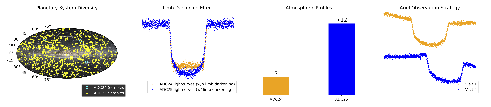

# Dataset Description
Characterizing the chemistry of exoplanets is of the great active projects in astronomy. The European Space Agency's Ariel mission will gather data on roughly 1,000 exoplanets by observing them while they transit in front of their host stars. Even with the powerful instruments on board Ariel, the resulting data will be based on a limited number of photons and include a fair amount of noise. Your challenge in this competition is to extract the chemical spectrum of the atmospheres of exoplanets using simulated Ariel data.

Relative to last year's challenge this iteration:

- Contains more train and test data.
- Uses unique star models for each planet.
- Has repeated observations of some planets.
- Incorporates upgrades to the physics model

This competition uses a hidden test set. When your submitted notebook is scored, the actual test data (including a full length sample submission) will be made available to your notebook. Expect to see roughly 1,100 exoplanets in the hidden test set.

# Files

## Metadata Files

train.csv Ground truth spectra.

wavelengths.csv The wavelength grid for each ground truth spectrum in the dataset.

axis_info.parquet Axis information for both instruments (AIRS-CH0 and FGS1).

adc_info.csv Analog-to-digital (ADC) conversion parameters (gain and offset) for restoring the original dynamic range of the data. Unlike last year's challenge, all planets use the same adc_info.

[train/test]_star_info.csv

- planet_id: Unique identifier for the star-planet system.
- Rs: Stellar radius in solar radii (R☉).
- Ms: Stellar mass in solar masses (M☉).
- Ts: Stellar effective temperature in Kelvin.
- Mp: Planetary mass in Jupiter masses (M⊕).
- e: Orbital eccentricity (dimensionless).
- P: Orbital period in days.
- sma: Semi-major axis in stellar radii (Rs), showing the orbital distance relative to the stellar radii.
- i: Orbital inclination in degrees.
- sample_submission.csv A sample submission in the correct format.

# Signal Files

The dataset comprises time series imagery from two separate instruments plus calibration data. Ariel contains multiple optical instruments, each specialising in different spectral bands and observing modes. FGS1 is the first channel of Ariel's Fine Guidance System (FGS). The main task of the Fine Guidance System is to enable centering, focusing, and guiding of the satellite but it will also provide high-precision photometry of the target star in the visible spectrum. It has a sensitivity between 0.60 and 0.80 µm. AIRS-CH0 is the first channel (CH0) of the Ariel InfraRed Spectrometer (AIRS). It is an infrared spectrometer with a sensitivity between 1.95 and 3.90 µm, and has a resolving power of approximately R=100. For more information about Ariel please visit the Ariel red book.

When examining frames from either instrument, you'll notice the flux levels oscillate between low and high counts. This is intentional and due to the design of the observing mode. Each pixel in the telescope's detector acts like a charge accumulator. The process begins with a sub-exposure recording the initial charge level before accumulation starts. After a set exposure time, another sub-exposure captures the new charge level. The pixels are then reset, and this cycle repeats for the duration of the observation. This allows for detailed temporal information to be captured. It's particularly useful for observing rapid changes, such as those occurring during a planetary transit. Each observation generates 135,000 frames for FGS1 and 11,250 frames for AIRS-CH0. Some planets in this dataset include an additional round of observation data.

[train/test]/[planet_id]/AIRS-CH0_signal_[observation_count].parquet signal data from the AIRS-CH0 instrument. Each file contains 11,250 rows of images captured at constant time steps noted in axis_info.parquet file for details of the time steps. Each 32 x 356 image has been flattened into 11392 columns. You can un-flatten the data with numpy.reshape(11250, 32, 356). The instruments generate data as uint16. To restore the full dynamic range you must divide the data by the matching gain value from adc_info.csv, add the offset value, and ensure the result type is float64.

[train/test]/[planet_id]/FGS1_signal_[observation_count].parquet signal data from the FGS1 instrument. Each file contains 135,000 rows of images at 0.1 second time steps. Each 32x32 image has been flattened into 1024 columns. You can un-flatten the data with numpy.reshape(135000, 32, 32). Similar to AIR-CH0, the data is generated in uint16. To restore the full dynamic range you must divide the data by the matching gain value from adc_info.csv, add the offset value, and ensure the result type is float64.

# Calibration Files

Calibration files record the electronic characteristics of the sensor and serve as "supporting frames" used in image post-processing to image signal to noise ratio. This website contains a brief introduction about the concept of calibration frames. This notebook may also be useful. The calibration files are largely duplicated.

[train/test]/[planet_id]/[AIRS-CH0/FGS1]_calibration/dark.parquet: Dark frames are exposures taken with the shutter closed, capturing the thermal noise and bias level of the sensor. These are used to subtract the dark current from science images.
[train/test]/[planet_id]/[AIRS-CH0/FGS1]_calibration/dead.parquet: Identifies dead or hot pixels on the sensor. Dead pixels do not respond to light, while hot pixels consistently produce high signal levels regardless of incoming light.
[train/test]/[planet_id]/[AIRS-CH0/FGS1]_calibration/flat.parquet: Flat field frames are created by imaging a uniformly illuminated surface. They are used to correct for variations in pixel-to-pixel sensitivity and optical system irregularities.
[train/test]/[planet_id]/[AIRS-CH0/FGS1]_calibration/linear_corr.parquet: Information about the linearity correction of the sensor. The response of the pixels in the detector becomes less linear as they fill with electrons, approaching the point of saturation, where the pixel can no longer collect additional electrons and its response to light becomes flat. For an accurate estimate of the signal, the instrument's response as a function of the received charge is calibrated, and the correction is calculated using a polynomial of degree n. This polynomial allows for the conversion of the number of electrons collected/measured by the pixel into the number of electrons that the detector would have generated with a linear response.

[train/test]/[planet_id]/[AIRS-CH0/FGS1]_calibration/read.parquet: Read noise frames capture the electronic noise introduced during the readout process of the sensor. This noise is present even when no light falls on the detector.